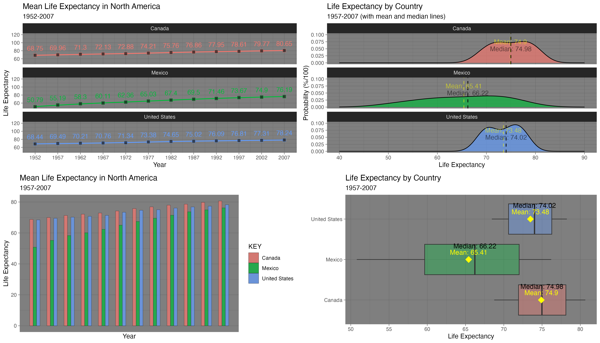
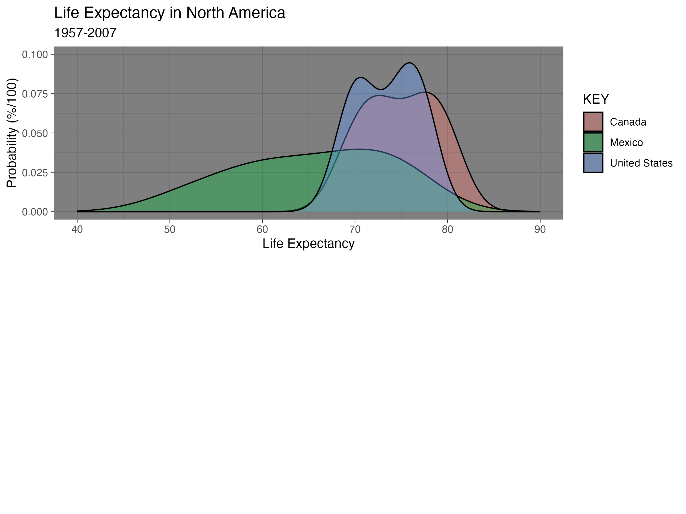
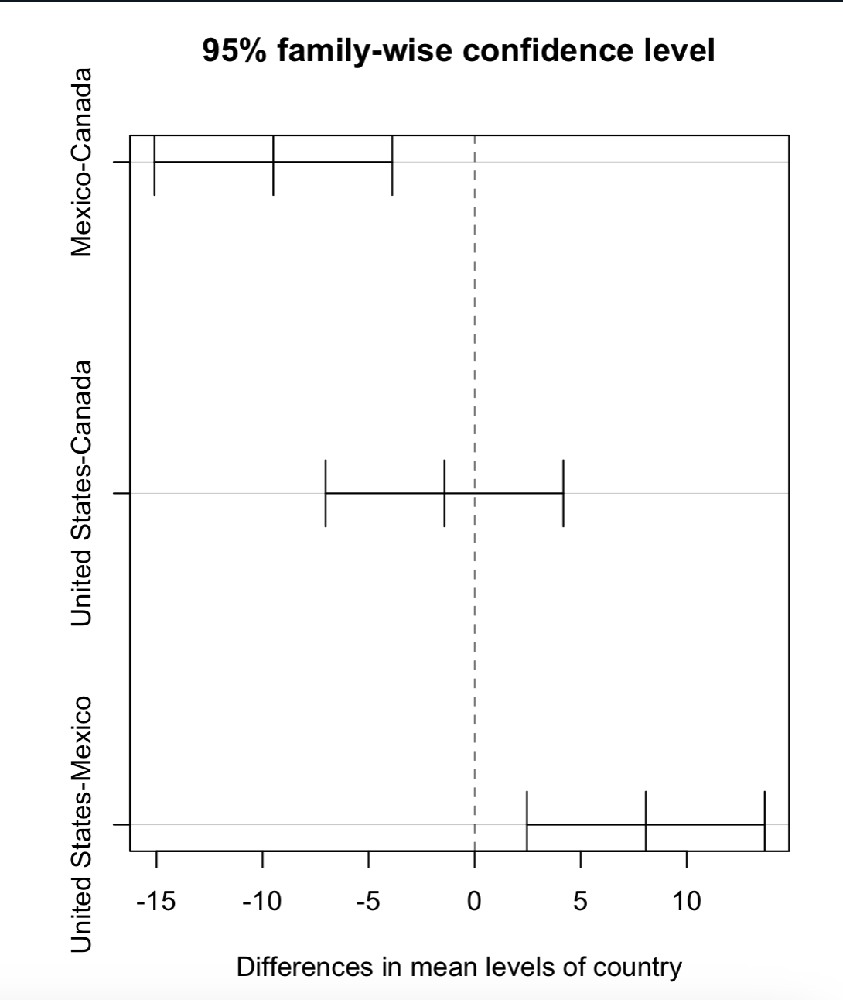

# Life Expectancy by Country: Canada, Mexico, and The United States
## Overview

This project demonstrates an end-to-end exploratory data analysis (EDA) of life expectancy trends in Canada, Mexico, and the United States using the Gapminder dataset.

The workflow demonstrates core data science, data analytics, and data visualization skills in R, including grouped statistical summaries (mean, median, standard deviation), multi-faceted visualization and plot composition with multiple libraries (ggplot2, tidyverse, patchwork, and gridExtra), statistical inference, and more. The analysis produces a suite of visualizations (density plots, boxplots, bar charts, scatterplots with trends) and statistical tests to evaluate differences in life expectancies across countries from 1957–2007.

## Repository Structure

- **[`images/`](images/)**
  - `AOV Life Expectancies.png`
  - `CONF.png`
  - `LIFE.png`
  - `LIFE2.png`

- **[`Gapminder Life Expectancies.R`](Gapminder%20Life%20Expectancies.R)**
  - Main R script used for analysis and visualization

- **`README.md`**
  - Project overview, methods, visualizations, and findings
    
## Project Visualizations

### Life Expectancy Dashboard

### Country Distribution Comparison

### ANOVA and Tukey HSD Results

### Confidence Interval Comparison

## Methods and Technologies

### Data Wrangling

- Filtered the Gapminder dataset to Canada, Mexico, and the United States
- Grouped and summarized life expectancy data by country and year
- Calculated means, medians, and standard deviations
- Created derived summary datasets for analysis and visualization
- Used the `%>%` pipe operator to create readable workflows

### Statistical Analysis

- Descriptive statistics
- One-way ANOVA
- Tukey HSD post-hoc comparisons
- 95% confidence intervals
- Interpretation of statistical significance

### Data Visualization

- Density plots with mean and median reference lines
- Boxplots with descriptive-statistic annotations
- Faceted scatterplots with smoothing trends
- Grouped bar charts
- Multi-panel layouts using `grid.arrange()`

### R Packages

- `gapminder`
- `tidyverse`
- `ggplot2`
- `patchwork`
- `gridExtra`

## Visualization Details

### `LIFE.png`

- **Top left:** Faceted trend plots showing changes in life expectancy over time for each country
- **Top right:** Distribution plot comparing mean and median life expectancy values
- **Bottom left:** Grouped bar chart comparing life expectancy across countries and years
- **Bottom right:** Boxplot summarizing the distribution of life expectancy values and highlighting potential outliers

### `LIFE2.png`

- Overlaid density plots comparing the life expectancy distributions of the three countries

### `AOV Life Expectancies.png`

- Displays the ANOVA and Tukey HSD comparison results

### `CONF.png`

- Displays 95% confidence intervals for differences between country means

## Limitations

- The analysis includes repeated observations for each country across multiple years
- The one-way ANOVA compares country means but does not explicitly model changes over time
- Results apply only to Canada, Mexico, and the United States
- The analysis identifies statistical associations but does not establish causal relationships

